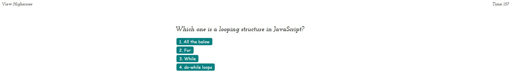
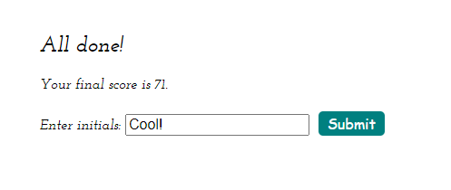

# Project: Web APIs: Code Quiz

  Deployable Link - >file:///C:/Users/Huante/Documents/Web%20API%202%20Quiz/Web-APIs-Code-Quiz/index.html

## Table of Contents: 
- [Project: Web APIs: Code Quiz](#project-web-apis-code-quiz)
  - [Table of Contents:](#table-of-contents)
  - [Description:](#description)
  - [Installation Instructions:](#installation-instructions)
  - [Test Command:](#test-command)
  - [Github:](#github)
  - [My Email Address:](#my-email-address)
  - [Other Contributors:](#other-contributors)
  - [Images:](#images)

## Description:
An typical module project with all of the techniques that applied for the 
web API quiz. This should include everything on top with the ReadME. and sure is looks great.

## Installation Instructions: 
Launch site in default browser.

## Test Command: 
To test type Click "Start Quiz" and answer questions. into the terminal

## Github: 
Check out more projects on my Github at https://github.com/AlexCodexter

## My Email Address:
If you have any questions please feel free to email me at alexhuantejones@gmail.com

## Other Contributors:
None at this time.

## Images:

